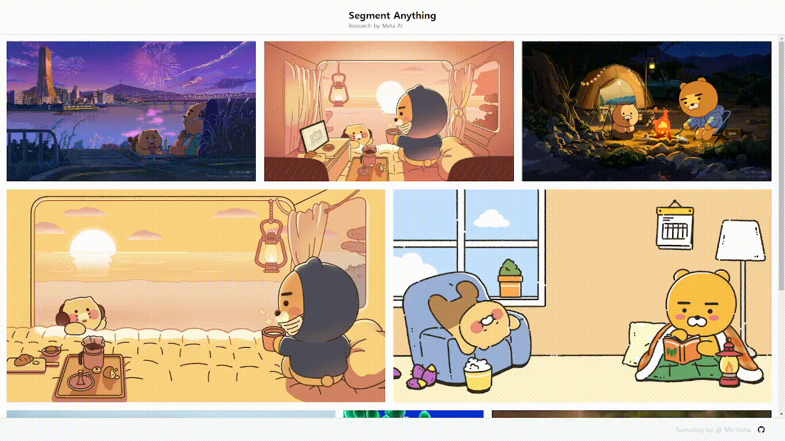

## Segment Anything Simple Web demo

This **front-end only** demo shows how to load a fixed image and `.npy` file of the SAM image embedding, and run the SAM ONNX model in the browser using Web Assembly with mulithreading enabled by `SharedArrayBuffer`, Web Worker, and SIMD128.

## Demo
<!--  -->

[](https://github.com/MizzleAa/segment-anything-demo/tree/main/frontend/readme/demo.mkv)


## Run the app

```
yarn && yarn start
```

Navigate to [`http://localhost:8080/`](http://localhost:8080/)

Move your cursor around to see the mask prediction update in real time.

## Export the image embedding

In the [ONNX Model Example notebook](https://github.com/facebookresearch/segment-anything/blob/main/notebooks/onnx_model_example.ipynb) upload the image of your choice and generate and save corresponding embedding.

Initialize the predictor

```python
checkpoint = "sam_vit_h_4b8939.pth"
model_type = "vit_h"
sam = sam_model_registry[model_type](checkpoint=checkpoint)
sam.to(device='cuda')
predictor = SamPredictor(sam)
```

Set the new image and export the embedding

```python
image = cv2.imread('src/assets/dogs.jpg')
predictor.set_image(image)
image_embedding = predictor.get_image_embedding().cpu().numpy()
np.save("dogs_embedding.npy", image_embedding)
```

Save the new image and embedding in `/assets/gallery`.

## Export the ONNX model

You also need to export the quantized ONNX model from the [ONNX Model Example notebook](https://github.com/facebookresearch/segment-anything/blob/main/notebooks/onnx_model_example.ipynb).

Run the cell in the notebook which saves the `onnx_example.onnx` file, download it and copy it to the path `/model/onnx_example.onnx`.

Here is a snippet of the export/quantization code:

```python
onnx_model_path = "sam_onnx_example.onnx"
onnx_model_quantized_path = "onnx_example.onnx"
quantize_dynamic(
    model_input=onnx_model_path,
    model_output=onnx_model_quantized_path,
    optimize_model=True,
    per_channel=False,
    reduce_range=False,
    weight_type=QuantType.QUInt8,
)
```

**NOTE: if you change the ONNX model by using a new checkpoint you need to also re-export the embedding.**

## Update the image, embedding, model in the app

Update the following file paths at the top of `enviroments.tsx`:

The current version does not support the `MULTI_MASK_MODEL_DIR`.
and `ERASE_API_ENDPOINT` is not supported.

```typescript
export const MODEL_DIR = "/model/onnx_example.onnx";
export const MULTI_MASK_MODEL_DIR ="/model/meta_multi_onnx.onnx"
export const API_ENDPOINT = "http://127.0.0.1:8000/ai/embedded";
export const ALL_MASK_API_ENDPOINT = "http://127.0.0.1:8000/ai/embedded/all";
export const ERASE_API_ENDPOINT = "";
```

## ONNX multithreading with SharedArrayBuffer

To use multithreading, the appropriate headers need to be set to create a cross origin isolation state which will enable use of `SharedArrayBuffer` (see this [blog post](https://cloudblogs.microsoft.com/opensource/2021/09/02/onnx-runtime-web-running-your-machine-learning-model-in-browser/) for more details)

The headers below are set in `configs/webpack/dev.js`:

```js
headers: {
    "Cross-Origin-Opener-Policy": "same-origin",
    "Cross-Origin-Embedder-Policy": "credentialless",
}
```

## Structure of the app

The example code provides a UI similar to the one provided in the demo version by Meta.

**`App.tsx`**

- Initializes ONNX model
- Loads image embedding and image
- Runs the ONNX model based on input prompts

**`Stage.tsx`**

- Handles mouse move interaction to update the ONNX model prompt

**`Tool.tsx`**

- Renders the image and the mask prediction

**`helpers/maskUtils.tsx`**

- Conversion of ONNX model output from array to an HTMLImageElement

**`helpers/onnxModelAPI.tsx`**

- Formats the inputs for the ONNX model

**`helpers/scaleHelper.tsx`**

- Handles image scaling logic for SAM (longest size 1024)

**`hooks/`**

- Handle shared state for the app
